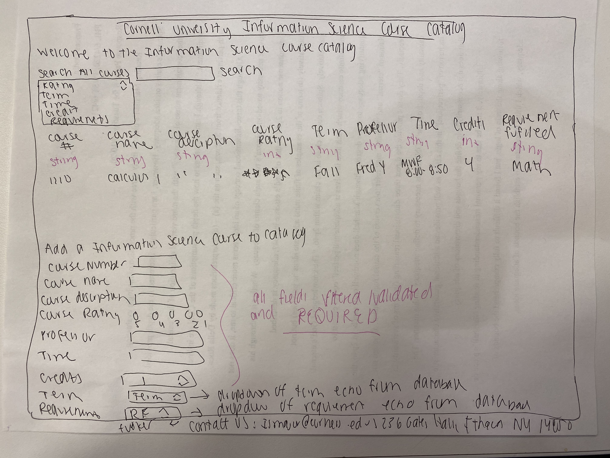

# Project 2: Design Journey

Be clear and concise in your writing. Bullets points are encouraged.

**Everything, including images, must be visible in VS Code's Markdown Preview.** If it's not visible in Markdown Preview, then we won't grade it.

## Catalog (Milestone 1)

### Describe your Catalog (Milestone 1)
> What will your collection be about? What types of attributes will you keep track of for the *things* in your catalog? 1-2 sentences.

My collection will be a course catalog that displays the avalible courses for the Information science major and minor. It will list out courses by semester(fall/spring) and can also be arranged based on the classes that satisfy a specifc concentration. Furthermore, the class catalog can be organized by the amount of credits avaible and if it is a undergraduate or graduate class. Finally, it will display the status of the class whether it is open, closed, or waitlisted. It will also have a search bar option that will allow the user to search for a specific class.

The course catalog will state the class number, a description about the class, amount of credits and the current professor.
### Target Audience(s) (Milestone 1)
My target audience is focaused on Cornell University undergraduate and graduate students who are interested in the Information Science Major or minor. It is also targetted for students who have already declared the information science major and are looking to see which class are required to fufill their elective, concentration or major requirements.

### Design Patterns (Milestone 1)
1) I reviewed the Fairfield University course catalog. This catalog is organized by courses in alphabetical order A-Z. It is also organized by specific programs A-Z. There is also a catalog archive section as well as a calender. The course catalog is split between an undergraduate catalog and graduate catalog.

The design created by Faifield University will be useful when designing my catalog. I really liked how the courses were alphabetized making it easier to find a specific course. I really like how their were two separate course catalogs for graduate and undergraduate programs which I will take into consideration for my design iterations because I want to focus my target audience on both.

2) The Wellesley College catalog is organized by filters. These filters include a search button. It is also organized by semester, department/subject,faculty, meeting times, distribution cateogy and other. The user also has the option to show only the courses with automated wailists options or show only courses with seat reservations.

The design created by Wellesley College was organized very specific. The user can implement all of their information and the databse will compute the users specific requirements. I think that for my catalog I will create filters that will allow the user to find what they are looking for in a timely manner and address their specific needs instead of constantly scrolling.

3) The UNCONN course catalog is a little bit different. Once you click on a speicifc meajor it lists out all of the required classes. These classes are hyperlinked and can be clicked on by the user. Once clicked on the hyperlink it will take you directly to the location of the class in the course catalog. It describes the name, amount of creidts, prerequisites and some more information about the class.

The UNCONN catalog was unique but I think that the design is not very efficient. It takes a lot of clicking and going back to see which classes are need for a specific major. It is hard becasue when you click on a link it takes you to the entire catalog instead of one compiled catalog that is specific to your major. Overall, this was a unique catalog that showed variety.


## Design & Planning (Milestone 2)

## Design Process (Milestone 2)
> Document your design process. Show us the evolution of your design from your first idea (sketch) to design you wish to implement (sketch). Show us the process you used to organize content and plan the navigation, if applicable.

This image is brainstorming the different categories needed to display all information to my target audience. I circuled the key idea that were necessary to reflect my catalog efficienctly and effectively. Furthermore, I brainstormed a couple of design outlines of how I wanted to format my catalog.


This image shows a website that contains the databse all on one page. It would just be a really long list of 26 items but nothing would be organized making it a lot of work for the user to find what they are looking for.


This image looks at different design iterations of how I want my final website to look like with the different navigation bar for the categories. I decided to split my navigation bar my different requirements needed to fufill that major. I was playing around with the format of the requirements in my iteration.


The final design includes a single page website with a footer along with a serach field to view the catalog by ratings, term , time, credits or requirements fufilled. Furthermore, there is an option to add a course to the catalog and all fields will be required.
## Partials (Milestone 2)


I am going to add a footer partial that includes the overall information science contact email. This will be helpful for others who are looking to contact someone based on the catalog classes.


## Database Schema (Milestone 2)
> Describe the structure of your database. You may use words or a picture. A bulleted list is probably the simplest way to do this. Make sure you include constraints for each field.
CREATE TABLE "catalog" (
	"course_number"	INTEGER NOT NULL,
	"course_name"	TEXT NOT NULL,
	"course_description"	TEXT NOT NULL,
	"term"	TEXT NOT NULL,
	"professor"	TEXT NOT NULL,
	"time"	TEXT NOT NULL,
	"credits"	INTEGER NOT NULL,
	"requirement_fufilled"	TEXT NOT NULL,
	PRIMARY KEY("course_number")
);

Table: catalog
- Course Number: the number of the course... is a primary key integer and is not null
- Course Name: the name of the course .... is a text field and is not null
- Course Description: A couple sentence description on the course... is a text field and is not null
- Term: state which semester/term the course is offered... is a text field and is not null
- Profesor: name of the professor .... text field and is not null
- Time: the time that the class meets at ... text field and is not null
- Credits: the amount of credits the class is .... text field and is not null
- Requirement Fufilled: what the class satisfies or fufills as an information science requirement ... text field and is not null


## Database Query Plan (Milestone 2)
> Plan your database queries. You may use natural language, pseudocode, or SQL.]

1. All records

    ```
    SELECT * FROM catalog;
    ```
2. Selecting Records for each page
'''
SELECT * FROM catalog WHERE requirement_fufilled = "Math";
SELECT * FROM catalog WHERE requirement_fufilled = "Core";
SELECT * FROM catalog WHERE requirement_fufilled = "Elective";
SELECT * FROM catalog WHERE requirement_fufilled = "Concentration";
'''

 4. Search Record
  ```
 SELECT *  FROM catalog where credits == '4';
   ```

3. Insert Record

    ```
"INSERT INTO catalog(course_number, course_name, course_description, course_rating, term, professor, time, credits, requirement_fufilled) VALUES (:value1,:value2,:value3,:value4,:value5,:value6,:value7,:value8,:value9);";

   ```
);

## Code Planning (Milestone 2)
> Plan any PHP code you'll need here.
The php code I will use is to echo out the variables in the specific table along with the information necessary for my partials. I will also use php to open the specific databse and make sure that all the values in my catalog are secure and not subjected to any threats or hacks. Furthermore, I will use PHP to run specific SQL queries that will display the necesseary data on the correct/specific pages based on requirement fufillment.

- function is search records
- also ratings function is a function created to give star ratings instead of using multiple lines of code

# Reflection (Final Submission)
> Take this time to reflect on what you learned during this assignment. How have you improved since Project 1? What things did you have trouble with?

I have defintely learned a lot since project 1. I think I really improved on debugging my code and being able to problem solve especially with small syntax errors. I thoguht this project was a lot mroe complex and challenging than project 1 but I feel that I have definitely learned a lot. It is cool to really see the hard work and process that back-end developers to through in order to make code more simplified and concise. I strugggled with creating my own functions. I thought it was really challenging to make a new function that was benefical or had some significance to the project. Furthermore, I found it challenging and time consuming to make sure that I utilized what I learned from project 1 and then implement it again in project 2. For example, making sure that everything is filtered. However, the labs really help me a lot during this project. Sometimes I get confused in my code because it is a little long or I have trouble finding things especially making sure all the variable names match up! I hope you enjoed my project!
